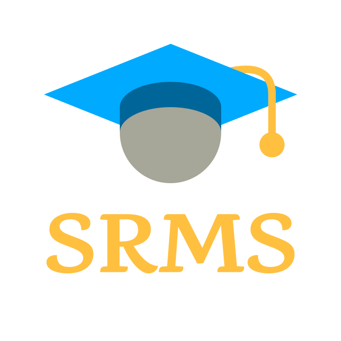

     

An app for a result management system that will assist in delivering outcomes
with an effective system. In addition, we want to bring parents, instructors,
and students together in one location.

## 📑 Changelog
See full change log from [here](https://github.com/ItsMe-JR/srms.apk/blob/main/CHANGELOG.md).

## 📜 License
This repo is licensed under the [BSD 3-Clause](https://github.com/ItsMe-JR/srms.apk/blob/main/LICENSE) © 2025 · [Jakir Hossain](https://github.com/ItsMe-JR)
